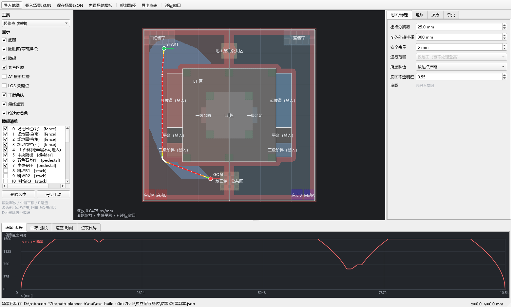

# 27robocon_path_planner

ROBOCON 女娲补天竞技赛 TR 离线路径点表生成器。

**选择起终点 → A*寻路 → 路径平滑 → 速度规划 → 导出C/C++或CSV点表。**

当前界面只规划地面路线：绕开坡道、阶梯、L1/L2及高架传递平台。地图默认采用仿真OBJ/SDF生成的场景；运行应用无需安装Gazebo、MuJoCo或下载仿真网格。



## 快速运行

### Windows免安装版

双击 `dist/ROBOCON_TR_Planner.exe`，无需Python。整理后的本地目录已放入EXE；Git仓库忽略dist，发布时可把EXE附在GitHub Releases中。首次启动需解压运行库，可能等待数秒。

### 源码运行

建议使用64位Python 3.10。已在Windows、Python 3.10.11验证，依赖版本固定在requirements.txt中。

```powershell
python -m venv .venv
.venv\Scripts\python.exe -m pip install -r requirements.txt
.venv\Scripts\python.exe main.py
```

Windows也可先双击 `requirements_install.bat`，再双击 `run_app.bat`。脚本优先使用项目虚拟环境，不依赖原开发电脑的Python安装路径。

## 使用流程

1. 默认已经载入仿真生成场地；“导入地图”用于叠加参考图片，不会自动生成障碍。图片需做坐标标定。
2. 选择“起终点”工具，在可行地面设置起点和终点，可拖动调整；航向在“规划”页设置。
3. 在“地图/标定”页填写实际机器人圆包络半径、余量和队伍。包络必须包括机械臂与载荷。
4. 点击“规划路径”或F5，检查地图路线、日志、速度曲线和点数。
5. 在“导出”页选择格式、数组名与坐标原点，保存C/C++或CSV文件。

地面模式不会把平台上的端点吸附到地面，也不会通过给坡道增加代价来允许它成为捷径。规划与导出都检查完整线段扫掠；改变机器人参数后，原路径需重新校验。

## 坐标与导出

场地坐标单位mm；原点在场地中心；+x向东、+y向北；红队x<0，蓝队x>0；yaw逆时针为正，单位rad。

板端点表五列保持：

```text
{ Vx[mm/s], Vy[mm/s], X[mm], Y[mm], yaw[rad] }
```

支持float数组、PathFollower::PathPoint和纯C结构体三种风格。起终点速度为0。板端定位坐标原点应与导出设置一致；CSV附带的支承面/高度信息不等同于z控制指令。

算法为八邻域A*（禁止斜向穿角）、LOS简化、圆弧倒角优先及样条回退、速度规划和点表重采样。仿真场景还进行圆包络与最终导出线段的物理通行复核。

## 地图来源

| 文件 | 用途 |
|---|---|
| scenes/nvwa_butian_2027_from_sim.json | 当前应用默认地图，由仿真OBJ/SDF生成；含登高结构的连接和高度元数据 |
| scenes/nvwa_butian_2027_template.json | 规则文字与图示推导的旧模板，用于参考和回归 |
| tests/fixtures/map_before_rules_20261006.json | 原地图回归基准，供历史登高实现测试使用 |

现有地图的几何、tag和enabled保持原工程内容。地面模式在独立导航层阻挡高平台投影，未把transfer.enabled改为true。20个可选料堆位置仍为assumed。旧模板缺少物理登高信息，界面禁止其比赛点表导出。

JSON里的meta.sim_source保留生成时的来源路径，作为溯源记录；应用加载已有JSON时不读取该目录。规则书和仿真网格不随此项目提供。

## 验证

激活虚拟环境后运行：

```powershell
python run_checks.py
```

基础验收检查完整性、两份地图、地面绕行、平滑、UI、C/CSV导出，并在out/checks_basic.md保存各命令完整输出。基础验收不证明外部仿真源复核已通过。

只检查本次地面绕行及圆弧反折：

```powershell
python ground_selftest.py
```

有仿真源文件时，设置路径再执行完整验收：

```powershell
$env:ROBOCON_SIM_ROOT = '你的gazebo_models-main目录'
python run_checks.py --with-sim
```

该目录需包含robocon_mujoco/meshes和robocon_ground/model.sdf。默认会尝试项目上级目录下的27th_gap_gazebo_model/gazebo_models-main。完整验收含源OBJ/SDF独立复核、坐标变换和错误模板故障注入，输出在out/checks_with_sim.md。缺少外部源时明确报告“未运行”，不会以基础PASS代替。

更新仿真生成地图使用build_template_from_sim.py；不要手动覆盖源JSON：

```powershell
python build_template_from_sim.py
python build_template_from_sim.py --write
python run_checks.py --with-sim
```

## 打包EXE

在Windows、64位Python环境中执行：

```powershell
python -m pip install -r requirements-build.txt
python build_exe.py
```

打包器生成单文件窗口EXE，内置两份地图及运行库，并把EXE单独复制到中文目录检查地图加载、规划、样条扩展和界面导出。验证通过才替换dist中的交付文件，已有文件先备份并使用原子替换。

## 目录

```text
27robocon_path_planner/
├── main.py                 应用入口
├── robocon_path/            地图、算法、速度规划、导出和UI
├── scenes/                  场地地图
├── tests/fixtures/          固定回归基准
├── run_checks.py            一条命令验收
├── *selftest.py / uitest.py  路线、物理语义与UI测试
├── build_template_from_sim.py / probe_sim_field.py
├── build_exe.py / exe_entry.py / exe_smoke.py
├── docs/                    截图
├── .github/workflows/       Windows基础验收
├── dist/                    本地EXE；Git忽略
└── out/                     运行与打包产物；Git忽略
```


## 当前边界

- 界面仅地面；历史登高代码作为显式回归保留，不代表已实现实车自动爬坡。
- 倒角空间不足时会缩小半径并记录日志；目标最小转弯半径不是硬保证。
- 默认300mm圆包络只是参数。700×700mm方形的外接圆约495mm，不能用350mm代替。
- selftest中横向加速度打印存在曲率单位换算遗漏，不作为动力学验收依据。几何测试通过不证明实车跟踪、打滑或舵轮动态能力。
- EXE已在本机Windows64位独立运行验证；其他系统需自行验证。

开发或修改前请先读[AGENT.md](AGENT.md)。已有文件先备份，使用patch或临时文件原子替换；保留备份到验收成功，禁止为了PASS放宽阈值。
